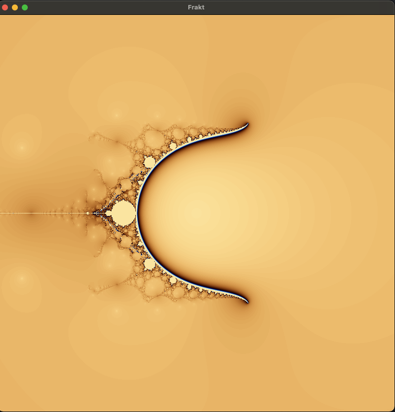
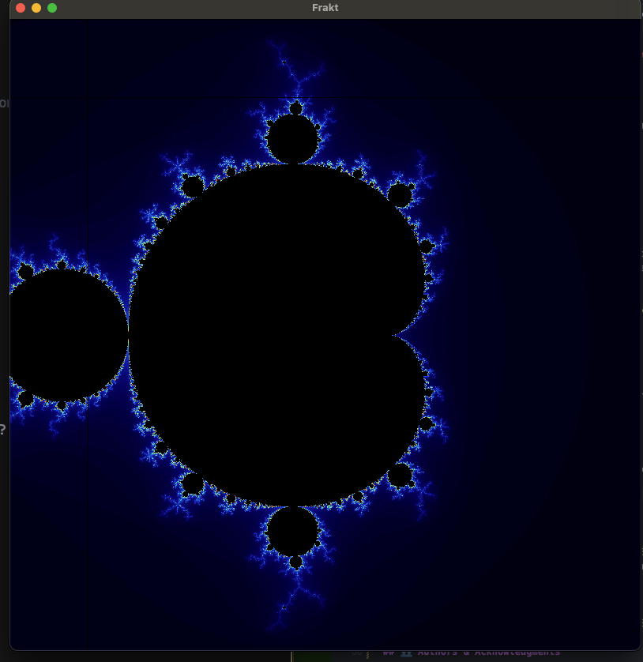
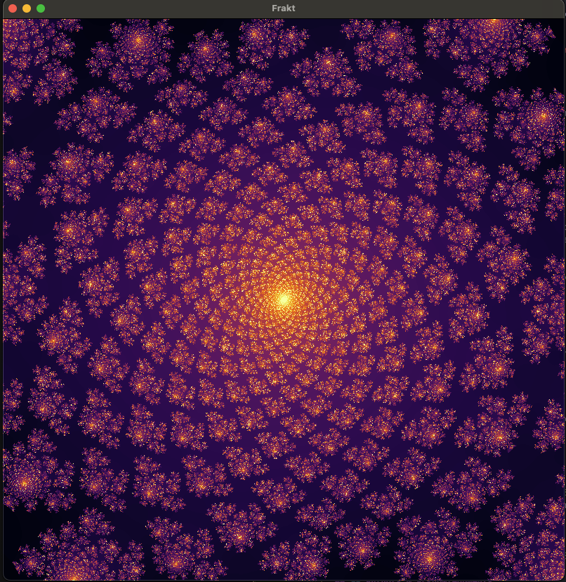
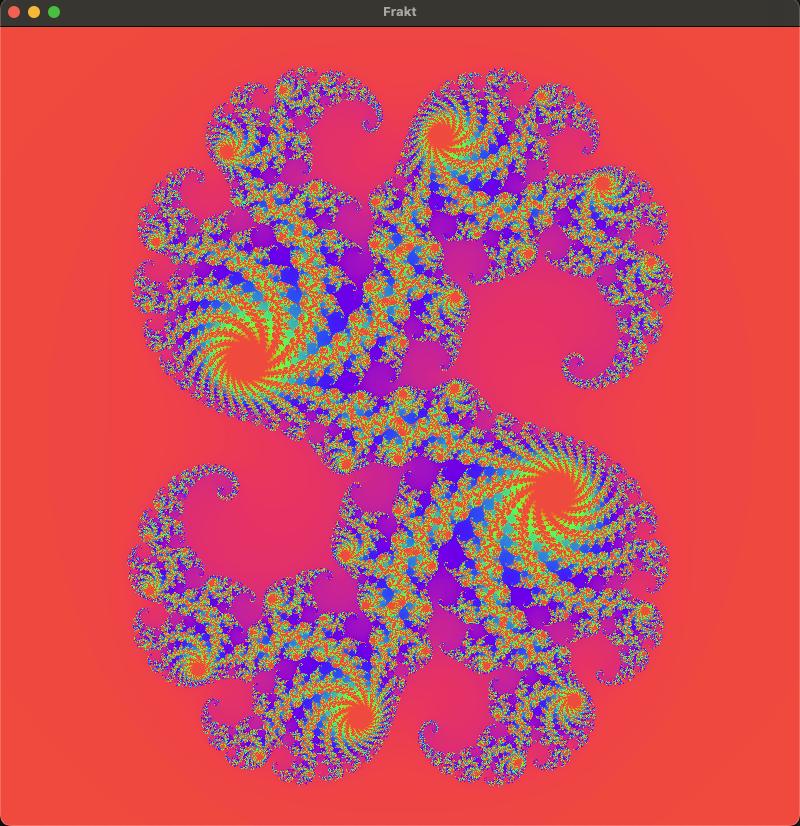
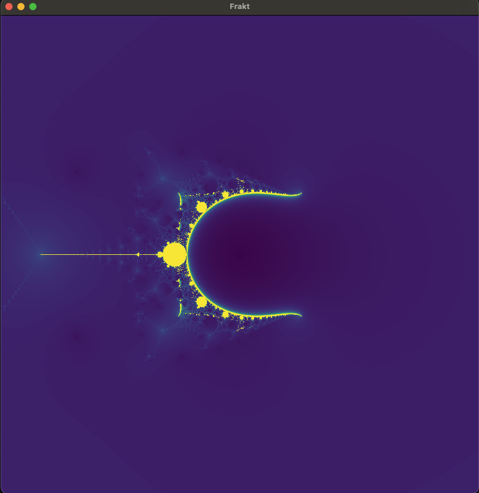

# Project Title: Frakt

This project is originally a school group project that I have decided to explore further and make it my own. The original project was a distributed system for generating and visualizing complex fractals in real-time. The project was built with Rust.

You can find the specific requirements for the original project in this


## 📖 Overview

Fractal Renderer is a high-performance, distributed system for generating and visualizing complex fractals in real-time. Built with Rust, it leverages the power of asynchronous programming and network communication to create stunning fractal images. The system supports various fractal types, including Mandelbrot, Julia sets, and Newton-Raphson, and offers customizable color palettes for vivid visualization. It also supports distributed workers for scalable fractal generation and interactive controls for real-time interaction with the fractal rendering.



## ✨ Features

- **High-Performance Rendering:** Utilizes worker dispatching and multi-threading for fast and efficient fractal rendering.
- **Distributed System:** Supports distributed workers for scalable fractal generation.
- **Interactive Visualization:** Offers real-time interaction with the fractal rendering, including zooming and panning.
- **Multiple Fractal Types:** Supports various fractal types including Mandelbrot, Julia sets, and Newton-Raphson.
- **Customizable Color Palettes:** Dynamic color palettes for rich and vivid fractal visualization.
- **Cross-Platform:** Runs on multiple platforms including Windows, macOS, and Linux.

## 🚀 Getting Started

### Prerequisites

- Rust and Cargo (latest stable version)
- TCP/IP network setup for distributed workers (optional)
- TODO: Web browser for real-time visualization (optional)

### Installation

1. **Clone the repository:**

   ```sh
   git clone https://github.com/adia-dev/frakt.git
   cd frakt
   ```

2. **Build the project:**

   ```sh
   cargo build --release
   ```

3. **Run the server (on the host machine):**

   ```sh
   cargo run -- --log-level debug server --width 800 --height 800 --address "localhost" --tiles 8
   ```

4. **Run worker instances (on worker machines, optional):**

   ```sh
   cargo run -- --log-level debug worker --address "localhost" --port 8080 --count 10 --name "worker-1"
   ```

### Configuration

Edit `config.toml` (or pass command-line arguments) to customize server settings, fractal parameters, and rendering options.

## 🖥️ Usage

- **Interactive Controls:**

  - **Zoom:** Scroll up/down or `P`/`M` keys.
  - **Pan:** Arrow keys to move the view.
  - **Change Fractals:** `K` key to cycle through fractal types.
  - **Change Color Palette:** `L` key to cycle forward through color palettes, `J` for backward.

- **Web Interface WIP:** Access the web dashboard at `http://<server_ip>:<server_port>` for real-time visualization (when enabled).

## 📚 Documentation

TODO:
For detailed documentation on fractal algorithms, system architecture, and API references, visit `[Documentation Link]`.

## 🎨 Gallery

<figure>
  
  <figcaption style="text-align:center">Mandelbrot</figcaption>
</figure>

<figure>
  
  <figcaption style="text-align:center">Iteraded Sin Z</figcaption>
</figure>

<figure>
  
  <figcaption style="text-align:center">Nova Newton Raphson Z3</figcaption>
</figure>

<figure>
  
  <figcaption style="text-align:center">Julia</figcaption>
</figure>

<figure>
  
  <figcaption style="text-align:center">Nova Newton Raphson Z4</figcaption>
</figure>

## 🤝 Contributing

Contributions are welcome! Please see `CONTRIBUTING.md` for how to contribute to the project, including bug reporting, feature requests, and code submissions.

## 📜 License

Distributed under the MIT License. See `LICENSE` for more information.

## 👥 Authors & Acknowledgments

- **Abdoulaye Dia** - _Initial work_ - [adia-dev](https://github.com/adia-dev)

Special thanks to all the resources, libraries, and tools that made this project possible.

- [Rust](https://www.rust-lang.org/)
- [Tokio](https://tokio.rs/)
- [Pixels](https://github.com/parasyte/pixels)
- Fractal documentation and resources
  - [Wikipedia](https://en.wikipedia.org/wiki/Fractal)
  - [Mandelbrot with Rust](https://rotgers.io/posts/mandelbrot-rust/)
  - [Iqui's Blog](https://iquilezles.org/articles/palettes/)
  - ShaderToy palette examples
    - [Palette 1](https://www.shadertoy.com/view/WlfXRN)
    - [Palette 2](https://www.shadertoy.com/view/3lSXz1)
